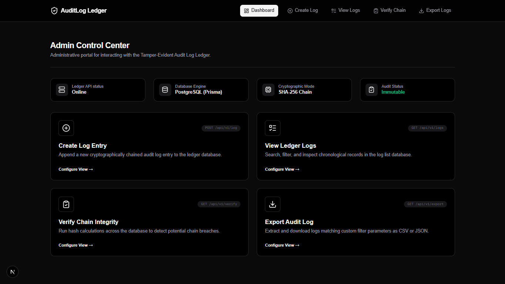
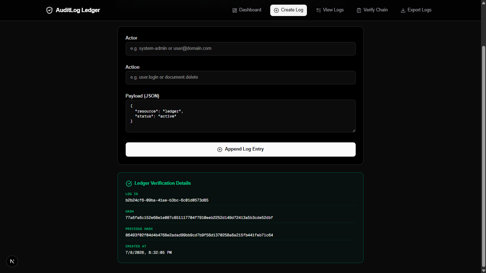
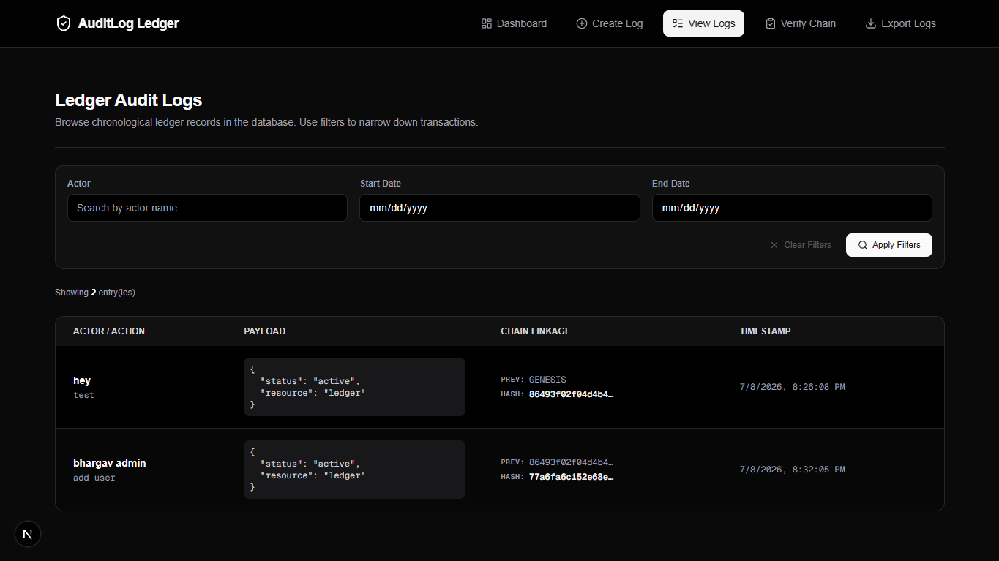
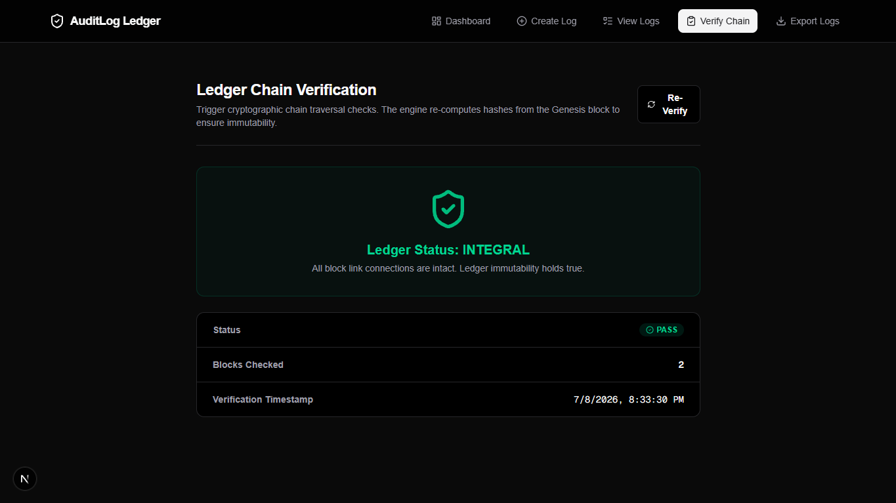
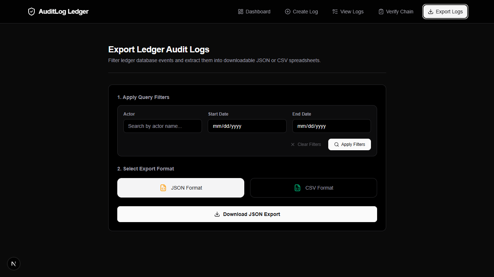

# Tamper-Evident Audit Log Ledger

## Project Overview

The Tamper-Evident Audit Log Ledger is a robust backend system designed to securely record and maintain administrative and system events. It provides an immutable, append-only architectural pattern that ensures the historical integrity of all recorded actions.

An append-only audit log dictates that once a record is written to the database, it can never be updated or deleted. This guarantees a permanent historical trail of operations.

To enforce immutability and detect unauthorized modifications, the system employs a cryptographic hash chain. Each log entry calculates its own SHA-256 hash using a combination of its payload data and the hash of the immediately preceding entry. This creates a cryptographically secure dependency chain. Any tampering with a historical record will alter its hash, subsequently breaking the chain for all subsequent records, making tampering immediately detectable.

## Features

- **Create Audit Log:** Append new events to the ledger with automatic hash generation.
- **Read Audit Logs:** Retrieve historical log entries in chronological order.
- **Filter Audit Logs:** Query logs based on actor, start date, and end date.
- **Verify Chain Integrity:** Programmatically traverse the entire ledger to validate cryptographic links and detect tampering.
- **Export Logs (CSV / JSON):** Extract audit records with optional filtering.
- **API Key Authentication:** Secure all endpoints against unauthorized access.
- **Rate Limiting:** Protect the API against abuse and denial-of-service attacks.
- **Automated Integration Testing:** Comprehensive test suite ensuring reliability across endpoints and core business logic.

## System Architecture

The application is built using a strict layered architecture to separate concerns and ensure maintainability.

Controller -> Service -> Repository -> Prisma -> PostgreSQL

- **Controller:** The entry point for HTTP requests. It handles extracting data from requests, passing it to the service layer, and formatting HTTP responses. It contains no business logic.
- **Service:** Contains the core business rules and cryptographic logic. It coordinates validation, orchestrates repository calls, and manages the hash chain generation.
- **Repository:** Manages all data access logic. It interacts directly with the database using the Prisma ORM, abstracting database operations from the service layer.
- **Prisma:** The Object-Relational Mapper (ORM) used to execute safe and typed database queries.
- **PostgreSQL:** The persistent relational database storing the ledger entries.

## Project Structure

```text
potens-intern-backend-bhargav-karande/
├── backend/
│   ├── prisma/             # Database schema and migrations
│   ├── src/
│   │   ├── config/         # Environment and application configuration
│   │   ├── controllers/    # Express route controllers
│   │   ├── middleware/     # Authentication, validation, and error handling
│   │   ├── repositories/   # Database access layer
│   │   ├── routes/         # Express route definitions
│   │   ├── services/       # Core business logic
│   │   ├── tests/          # Integration and unit tests
│   │   ├── types/          # TypeScript interface definitions
│   │   ├── utils/          # Helper functions (e.g., cryptographic hashing)
│   │   └── app.ts          # Express application setup
│   └── package.json
└── frontend/
    ├── src/
    │   ├── app/            # Next.js App Router pages
    │   ├── components/     # Reusable React UI components
    │   ├── lib/            # Shared utilities and API client
    │   └── types/          # Shared interface definitions
    └── package.json
```

- **`backend/`**: Contains the complete Node.js API server and business logic.
- **`frontend/`**: Contains the Next.js administrative dashboard used to interact with the API.
- **`prisma/`**: Defines the database schema and tracks migration history.
- **`src/services/`**: The most critical folder, containing the cryptographic chaining and validation algorithms.
- **`src/app/`**: Next.js routing directory containing the views for the administrative interface.

## Tech Stack

### Backend
- Node.js
- TypeScript
- Express
- Prisma ORM
- Zod
- Pino
- Express Rate Limit

### Frontend
- Next.js 15
- TypeScript
- Tailwind CSS
- Axios
- React Hook Form
- Zod
- React Hot Toast

### Database
- PostgreSQL

### Testing
- Vitest
- Supertest

## Installation

### Clone repository

```bash
git clone https://github.com/bhargav-karande/potens-intern-backend-bhargav-karande.git
cd potens-intern-backend-bhargav-karande
```

### Backend setup

1. Navigate to the backend directory and install dependencies:
```bash
cd backend
npm install
```

2. Configure environment variables. Copy the example file and modify as needed:
```bash
cp .env.example .env
```

3. Run Prisma migrations to set up the database schema:
```bash
npx prisma migrate dev
```

4. Generate the Prisma client:
```bash
npx prisma generate
```

5. Start the backend development server:
```bash
npm run dev
```

### Frontend setup

1. Open a new terminal and navigate to the frontend directory:
```bash
cd frontend
npm install
```

2. Configure environment variables:
```bash
cp .env.example .env.local
```

3. Start the frontend development server:
```bash
npm run dev
```

## Environment Variables

### Backend

| Variable | Description |
|----------|-------------|
| `DATABASE_URL` | The PostgreSQL connection string used by Prisma. |
| `API_KEY` | The secret key required in the `X-API-Key` header to access the API. |
| `PORT` | The port number on which the Express server will run (default: 3000). |
| `FRONTEND_URL` | The allowed origin for Cross-Origin Resource Sharing (CORS). |

### Frontend

| Variable | Description |
|----------|-------------|
| `NEXT_PUBLIC_API_URL` | The base URL of the backend API server. |
| `NEXT_PUBLIC_API_KEY` | The API key used by the frontend to authenticate requests. |

## API Endpoints

### POST /api/v1/log

**Purpose:** Append a new event to the audit log ledger.

**Method:** `POST`

**Request:**
```json
{
  "actor": "user@example.com",
  "action": "DOCUMENT_DELETE",
  "payload": { "documentId": "12345" }
}
```

**Response:** Returns the created `AuditLogEntry` object including the generated hash.

### GET /api/v1/logs

**Purpose:** Retrieve a list of audit log entries.

**Method:** `GET`

**Request:** Query parameters (optional): `actor`, `startDate`, `endDate`.

**Response:** Returns an array of `AuditLogEntry` objects.

### GET /api/v1/logs/:id

**Purpose:** Retrieve a specific audit log entry by its unique identifier.

**Method:** `GET`

**Request:** URL parameter `id`.

**Response:** Returns a single `AuditLogEntry` object.

### GET /api/v1/verify

**Purpose:** Perform a full cryptographic verification of the ledger chain.

**Method:** `GET`

**Request:** No parameters.

**Response:** Returns a `VerificationResult` indicating `PASS` or `FAIL`, the number of entries checked, and details of any broken links.

### GET /api/v1/export

**Purpose:** Export audit logs in the specified format.

**Method:** `GET`

**Request:** Query parameters: `format` (`csv` or `json`), and optional filters (`actor`, `startDate`, `endDate`).

**Response:** Returns a file download stream of the requested data.

## Hash Chain Workflow

The integrity of the ledger relies on a continuous cryptographic hash chain.

1. **GENESIS:** The very first entry in the ledger has no preceding record. It uses a predefined, static `GENESIS` constant as its previous hash.
2. **previousHash:** Every subsequent entry queries the database for the most recently created record and stores its hash as the new entry's `previousHash`.
3. **SHA-256 Generation:** A new hash is deterministically generated for the entry by concatenating the `previousHash`, `actor`, `action`, serialized `payload`, and `createdAt` timestamp, and applying the SHA-256 algorithm.
4. **Chain Verification:** The verification process loads the ledger chronologically and recalculates the hash for every entry based on the original data. It then compares the recalculated hash against the stored hash, and ensures the `previousHash` matches the actual hash of the prior record.
5. **Tamper Detection:** If an entry is modified at the database level, its recalculated hash will differ from the stored hash. Additionally, the subsequent entry will contain a `previousHash` that no longer matches, instantly flagging the location of the tampering.

## Export Formats

The system supports extracting audit records for external analysis.

- **CSV:** Comma-Separated Values format, suitable for spreadsheet applications.
- **JSON:** JavaScript Object Notation format, suitable for programmatic ingestion.
- **Filtering:** Both export formats respect the `actor`, `startDate`, and `endDate` query parameters to limit the extracted dataset.

## Security Features

- **API Key Authentication:** All routes require a valid `X-API-Key` header, preventing unauthorized access.
- **Rate Limiting:** Global rate limiting mitigates brute-force and denial-of-service attacks.
- **Immutable Ledger:** The architecture strictly prohibits UPDATE and DELETE database operations through the application layer.
- **Hash Verification:** Cryptographic chains detect direct database tampering.
- **CSV Formula Injection Protection:** The CSV export mechanism sanitizes fields starting with `=, +, -, @` to prevent spreadsheet software from executing malicious formulas.
- **Validation:** Strict runtime input validation using Zod ensures only well-formed data interacts with the business logic.

## Testing

The backend includes a comprehensive testing strategy.

- **Vitest:** A fast unit testing framework used as the test runner.
- **Supertest:** An HTTP assertion library used to test Express routes without starting a dedicated server.
- **Integration Tests:** Tests execute against a dedicated test database, simulating real-world scenarios.

Run the test suite using:
```bash
npm test
```

The test suite covers:
- Route authentication rejection.
- Input validation failures.
- Successful log creation and retrieval.
- Complex filtering logic.
- Complete chain verification against both intact and intentionally corrupted test databases.
- CSV and JSON export formatting.

## Frontend

The administrative dashboard provides a visual interface to interact with the ledger.

- **Dashboard:** The landing page offering an overview of the system status and quick links to various modules.
- **Create Log:** A form utilizing React Hook Form and Zod for client-side validation to manually append new records to the chain.
- **Logs:** A tabular interface to browse the chronological history of the ledger, complete with query filters.
- **Verify:** A dedicated dashboard to trigger the cryptographic chain traversal check and display the health status of the ledger.
- **Export:** A configuration screen to apply filters and select between CSV and JSON download formats.

## Screenshots

### Dashboard


### Create


### Logs


### Verify


### Export


## Design Decisions

- **Strict Layered Architecture:** The application enforces a strict separation between controllers, services, and repositories to ensure business logic is isolated and testable.
- **Append-Only Database Operations:** Prisma is configured without any `update` or `delete` operations in the repositories to enforce the ledger's immutability at the application level.
- **Cryptographic Hashing Algorithm:** SHA-256 was selected for its balance of security and performance.
- **Client-Side vs Server-Side Validation:** Zod is used on both the frontend and backend to guarantee that invalid or malformed data never reaches the business logic or database.

## Assumptions

- The underlying PostgreSQL database is secured and cannot be directly manipulated by unauthorized users bypassing the application layer.
- The `API_KEY` is securely distributed to authorized clients only.
- The chronological ordering of events is primarily determined by the database's sequential processing and the internal `createdAt` timestamp.

## Limitations

- The current hashing mechanism verifies the integrity of the chain chronologically. Extremely large ledgers may take significant time to verify from the genesis block without implementing snapshotting or pagination.
- Concurrent heavy write operations might experience slight bottlenecks due to the requirement of calculating hashes sequentially based on the most recent `previousHash`.

## What is Broken or Unfinished

The core requirements (tamper-evident hash chaining, API endpoints, testing, frontend) are fully functional and robust.

However, the following optional stretch goals were not attempted/finished:
- **Merkle-tree style batching:** Not implemented. The current `/verify` endpoint scans the ledger chronologically. For very large datasets, this linear verification would need to be upgraded to a Merkle tree structure.
- **Docker Compose:** While the app runs easily via `npm run dev`, a `docker-compose.yml` was not included in this iteration.
- **CLI Command (`npm run verify`):** The verification logic is currently bound to the Express service and Next.js frontend, but not exposed as an isolated CLI command.

## What I Would Build Next (Future Improvements)

- **Pagination:** Implement cursor-based pagination for the retrieval endpoints to handle massive ledgers efficiently.
- **Streaming CSV exports:** Refactor the export endpoint to stream data directly from the database to the client, reducing memory overhead for large datasets.
- **JWT Authentication:** Migrate from static API keys to token-based authentication for granular user identification.
- **Role Based Access:** Implement authorization layers to restrict certain actions based on user roles.

## Author

**Bhargav Karande**

- GitHub: [BhargavK001](https://github.com/BhargavK001)
- LinkedIn: [Bhargav Karande](https://www.linkedin.com/in/bhargav-karande/)
- Portfolio: [bhargav-karande.com](https://bhargavkarande.dev)

## AI Use Log

- **Tool:** Google DeepMind IDE Agent
- **Message Count:** ~60 iterations
- **Usage:** Used to architect the backend application layers, write the Next.js frontend components, generate the Vitest automated testing suite, and structure the documentation files.
