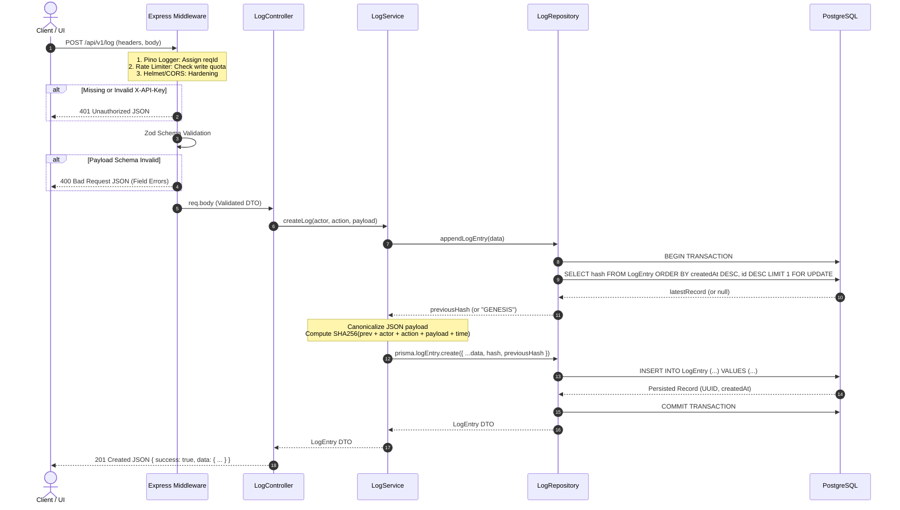
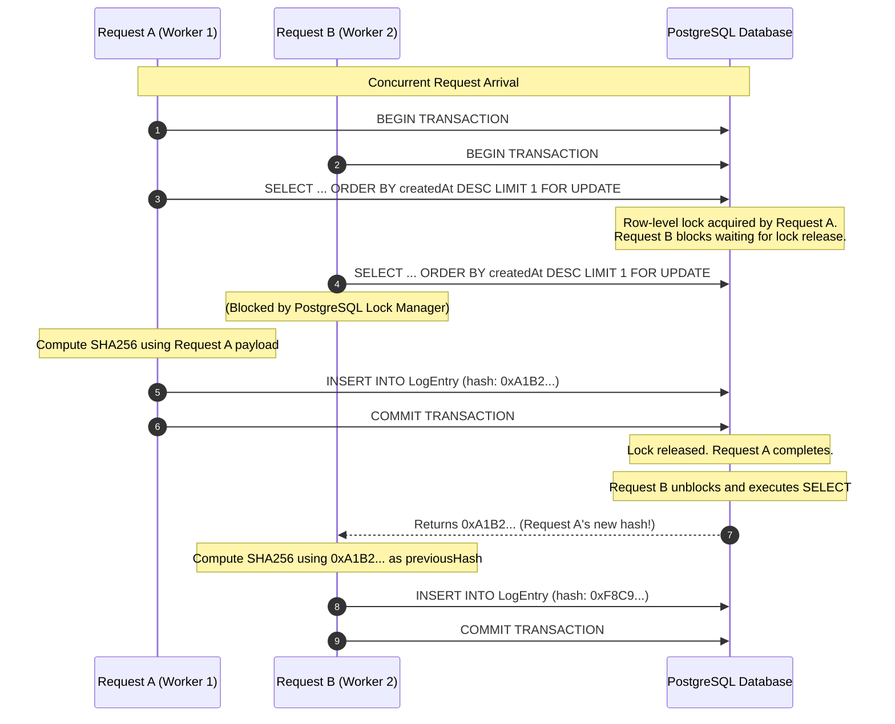
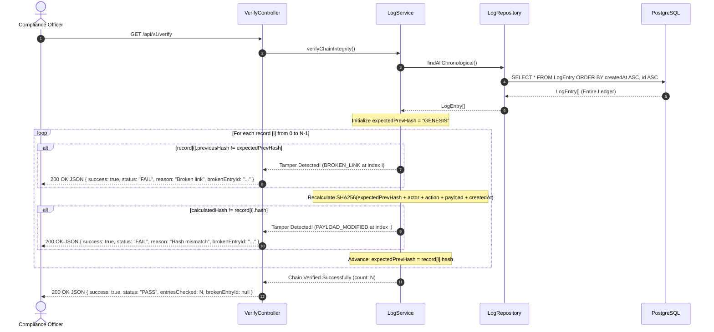

# Architectural Blueprint & System Design

> **Project:** Tamper-Evident Append-Only Audit Log System  
> **Document:** Architecture & System Design (`docs/03_ARCHITECTURE.md`)  
> **Author:** Bhargav Karande  
> **Version:** 2.1  
> **Status:** Production Reference  

---

# 1. Overview, Constraints & Non-Functional Requirements

## System Purpose
The **Tamper-Evident Append-Only Audit Log System** is a production-inspired service engineered to record immutable audit events. It guarantees that once a log entry is persisted, it cannot be modified, deleted, or reordered without immediate detection. This is achieved by linking each record to its predecessor via a SHA-256 cryptographic hash chain.

## Data Ownership & Boundary Model
* **Backend Service (Authoritative Source):** The Node.js/Express backend maintains exclusive domain and write ownership over the audit ledger. It encapsulates all cryptographic hashing, transaction locking, and schema validation.
* **Database (Storage Engine):** PostgreSQL acts as a passive, append-only persistence layer. It enforces structural integrity via unique constraints and types (`JSONB`, `UUID`).
* **Frontend Client (Zero-Trust Consumer):** The Next.js UI is a stateless presentation layer. It possesses no database awareness, contains no verification logic, and interacts with the ledger purely through REST HTTP endpoints.

## System Constraints
* **Single-Table Schema:** All audit events are stored in a single `LogEntry` table, as defined in `02_DATABASE.md`. No separate user, role, or auxiliary tables are introduced.
* **Strict Append-Only Storage:** The architecture strictly prohibits `UPDATE`, `PATCH`, `DELETE`, or `TRUNCATE` operations on historical log records.
* **Sequential Verification:** Verification must evaluate the hash chain chronologically from genesis to the latest record.
* **Authentication Scope:** Security is governed by a static API key (`X-API-Key`) validated via environment variables.

## Non-Functional Requirements (NFRs)

| Metric / Category | Target Requirement | Engineering Strategy |
| :--- | :--- | :--- |
| **Data Integrity** | 100% Tamper Detection | Cryptographic SHA-256 chaining; any bit-level modification breaks all subsequent hashes. |
| **Write Latency** | p95 $< 50\text{ms}$ for `POST /api/v1/log` | Interactive Prisma transactions with indexed tail-lookup (`createdAt DESC, id DESC`). |
| **Verification Speed** | $< 200\text{ms}$ for 10,000 records | In-memory sequential SHA-256 recalculation without database write-lock contention. |
| **Security Isolation** | Zero Unvalidated Traffic | Strict Zod schema stripping at the HTTP boundary; immediate HTTP 401/400 termination. |
| **Concurrency & ACID** | Zero Hash Forking | Database transaction boundaries prevent race conditions during concurrent log appending. |

---

# 2. Architectural Principles (Practical Realization)

Rather than treating design principles as academic theory, the codebase implements them through concrete structural boundaries:

* **Layered Separation of Concerns:** Control flow is strictly unidirectional: `Route` $\to$ `Controller` $\to$ `Service` $\to$ `Repository`. Repositories never import Express types; controllers never execute SQL or Prisma queries.
* **Fail-Fast Defense:** Incoming HTTP requests must clear four sequential middleware barriers (Rate Limiting $\to$ Helmet/CORS $\to$ API Key Auth $\to$ Zod Validation) before reaching domain logic.
* **Structural Immutability:** The `LogRepository` class explicitly omits update and delete methods. If a developer attempts to modify a record in code, the method does not exist.
* **Deterministic Execution:** SHA-256 hashing relies on recursive, alphabetical JSON key-sorting (`canonicalize.ts`). Identical payloads always generate identical hashes regardless of client key ordering.

---

# 3. High-Level System Architecture

```
                                [ External Client / Next.js UI ]
                                              │
                                              ▼ (HTTPS / REST)
                              ┌───────────────────────────────┐
                              │     Express HTTP Server       │
                              └───────────────┬───────────────┘
                                              │
                    ┌─────────────────────────┴─────────────────────────┐
                    ▼                                                   ▼
       [ Defensive Middleware Pipeline ]                       [ Pino Logger Engine ]
    1. Rate Limiter (Write Throttling)                       • Unique Request ID Binding
    2. Helmet Header Hardening                               • Asynchronous JSON Output
    3. CORS Origin Verification                              • Latency & Status Tracking
    4. X-API-Key Authentication                              
    5. Zod Strict Schema Validation                          
                    │
                    ▼
       ┌───────────────────────────────┐
       │       Controllers Layer       │  ──► Map HTTP Request/Response DTOs
       └───────────────┬───────────────┘
                       │
                       ▼
       ┌───────────────────────────────┐
       │        Services Layer         │  ──► SHA-256 Hashing, Chain Verification,
       └───────────────┬───────────────┘      & Deterministic Serialization
                       │
                       ▼
       ┌───────────────────────────────┐
       │      Repositories Layer       │  ──► Append-Only Abstraction (Create / Find)
       └───────────────┬───────────────┘
                       │
                       ▼
       ┌───────────────────────────────┐
       │       Prisma ORM Client       │  ──► Type-Safe Parameterized SQL Generation
       └───────────────┬───────────────┘
                       │
                       ▼
       ┌───────────────────────────────┐
       │      PostgreSQL Database      │  ──► ACID Transactions, JSONB, & Indexes
       └───────────────────────────────┘
```

---

# 4. Project Structure

The codebase is structured by functional layer to isolate domain rules from transport mechanics and database tooling.

## Backend Structure (`backend/src/`)
```
backend/src/
├── config/          # Environment variable loading & fail-fast Zod validation
├── controllers/     # HTTP request handlers (status codes, JSON serialization)
├── middleware/      # Auth, rate limiting, security headers, & centralized errorHandler
├── repositories/    # Prisma data access layer (strictly append-only methods)
├── routes/          # Express route definitions & middleware chain assembly
├── services/        # Cryptographic hashing, sequential verification, & export logic
├── types/           # Shared TypeScript interfaces, DTOs, & error types
├── utils/           # Canonical JSON stringifier & SHA-256 hashing helper
├── schemas/         # Zod validation schemas (e.g. auditLog.schema.ts)
└── server.ts        # Application bootstrap & graceful shutdown handler
```
**Why this structure matters:** Isolating `repositories/` allows swapping the database engine without changing `services/`. Isolating `controllers/` allows testing domain services via automated test runners or worker queues without mocking HTTP request objects.

## Frontend Structure (`frontend/src/`)
```
frontend/src/
├── app/             # Next.js App Router pages (Dashboard, Create, Logs, Verify, Export)
├── components/      # UI primitives (shadcn) & domain components (LogTable, VerifyBadge)
├── hooks/           # TanStack Query wrappers for API fetching & mutation caching
├── lib/             # Axios singleton with automated X-API-Key header injection
├── providers/       # Global React Query & Sonner Toast notification providers
└── types/           # Client-side TypeScript interfaces mirroring backend DTOs
```

---

# 5. Backend Layer Architecture

| Layer | Primary Responsibility | Explicitly Allowed (Should Do) | Explicitly Prohibited (Never Do) |
| :--- | :--- | :--- | :--- |
| **Routes** | Define HTTP endpoints and attach middleware pipelines. | Map HTTP verbs (`POST`, `GET`) to controllers; attach Zod validators. | Execute domain logic; call Prisma; manipulate HTTP responses directly. |
| **Controllers** | Orchestrate the HTTP request/response lifecycle. | Extract typed DTOs from `req`; invoke services; return standardized JSON. | Compute SHA-256 hashes; construct SQL/Prisma queries; handle raw errors. |
| **Services** | Enforce business rules and cryptographic integrity. | Fetch `previousHash`; compute SHA-256; execute verification loop. | Access `req`/`res` objects; execute raw DB queries without repositories. |
| **Repositories** | Abstract database persistence and queries. | Execute `create`, `findMany`, and `$transaction` via Prisma. | Implement `update` or `delete`; include business validation or auth logic. |
| **Schemas** | Guarantee runtime type safety at the system boundary. | Validate string lengths, JSONB structures, and date query formats. | Query database for validation; execute domain state transformations. |
| **Middleware** | Intercept requests for security, logging, and errors. | Check `X-API-Key`; bind `reqId`; catch unhandled errors $\to$ JSON response. | Execute core business logic; swallow exceptions without logging traces. |

---

# 6. Frontend Architecture

The frontend serves as a functional demonstration client for the audit ledger:
* **State Management & Caching:** TanStack Query (`useQuery`, `useMutation`) manages server state, caching log queries, and automatically invalidating lists when a new log is appended.
* **Network Communication:** A centralized Axios instance (`lib/api.ts`) injects `process.env.NEXT_PUBLIC_API_KEY` into the `X-API-Key` header for every outgoing request.
* **Client Validation:** React Hook Form paired with Zod schemas validates payload syntax before network transmission, mirroring backend constraints.

---

# 7. Complete Request Lifecycle

The following sequence diagram illustrates the step-by-step execution and defensive short-circuits of an incoming HTTP request.



---

# 8. Log Creation Flow, Transactions & Concurrency

When appending an immutable record, the system must guarantee that two simultaneous requests do not read the same `previousHash`, which would result in a branched or corrupted hash chain.

## Concurrency Control & Transaction Mechanics



### Technical Execution Details
1. **Interactive Transaction Boundary:** All log creations execute within `prisma.$transaction(...)`.
2. **Tail Locking (`FOR UPDATE`):** To prevent race conditions under Read Committed isolation, the repository queries the latest record using `SELECT hash ... FOR UPDATE`. This acquires an exclusive row-level lock on the current tail of the chain.
3. **Queueing Concurrent Writes:** If Request B arrives while Request A is calculating its hash, PostgreSQL blocks Request B at the `SELECT` statement until Request A commits or rollbacks.
4. **Genesis Anchor:** If `SELECT` returns empty (table initialization), the system assigns the literal string `"GENESIS"` as the `previousHash`.
5. **Deterministic Hashing:** The payload is stringified using `canonicalize()`, ensuring alphabetical key sorting. The SHA-256 digest is computed over `previousHash + actor + action + serializedPayload + createdAt.toISOString()`.

---

# 9. Verification Flow & Algorithm

The verification engine traverses the database to confirm historical integrity.



## Algorithmic Complexity & Justification
* **Time Complexity:** $\mathcal{O}(N)$ where $N$ is total records. Each log is read and hashed exactly once.
* **Space Complexity:** $\mathcal{O}(N)$ for array memory loading, or $\mathcal{O}(1)$ when implemented via PostgreSQL streaming cursors (`Prisma.$queryRawStream`).
* **Why Sequential Verification is Used:** Unlike decentralized networks requiring Merkle trees to verify inclusion without downloading multi-terabyte ledgers, this system operates on a centralized relational database. For enterprise audit volumes (up to hundreds of thousands of rows), sequential hashing in Node.js completes in under $200\text{ms}$, providing definitive mathematical proof of complete chain continuity from genesis to present without tree-rebalancing overhead.

---

# 10. Export Flow

The `GET /api/v1/export` endpoint extracts audit records for external review while supporting query filtering.
1. **Validation:** Zod validates `startDate`, `endDate` (ISO-8601 strings converted to `Date` objects), and optional `actor` strings.
2. **Dynamic Query Building:** The service builds a Prisma `where` clause:
   ```typescript
   const where: Prisma.LogEntryWhereInput = {};
   if (actor) where.actor = actor;
   if (startDate || endDate) {
     where.createdAt = { ...(startDate && { gte: startDate }), ...(endDate && { lte: endDate }) };
   }
   ```
3. **Execution & Formatting:** Queries execute using indexed columns (`actor`, `createdAt`). The response packages records into a standardized JSON DTO. Note: Exporting a filtered subset naturally breaks sequential chain continuity in the exported file; the response includes metadata clarifying that it is a filtered administrative extract.

---

# 11. Security Architecture & Threat Model

The application employs defense-in-depth to protect ledger integrity against external and internal vectors.

## STRIDE Threat Model Matrix

| Threat Category | Specific Attack Vector | Architectural Mitigation | Residual Risk & Handling |
| :--- | :--- | :--- | :--- |
| **Spoofing** | Attacker attempts to submit false logs without authentication. | `X-API-Key` authentication middleware inspects requests before routing. Unauthenticated requests receive HTTP 401. | Key compromise; mitigated by storing secrets in `.env` outside version control and supporting key rotation. |
| **Tampering** | Attacker modifies historical logs via SQL injection or direct DB access. | Prisma ORM uses parameterized queries (zero SQLi risk). Cryptographic SHA-256 chaining detects direct DB modifications during `GET /api/v1/verify`. | Database administrator modifies records and recalculates all subsequent hashes; mitigated by external WORM backups. |
| **Repudiation** | User denies performing a logged system action. | Append-only ledger stores immutable timestamps, actor identities, and payloads tied to cryptographically verified chains. | None; historical records cannot be altered without failing verification. |
| **Information Disclosure** | Error messages leak database schema, queries, or stack traces. | Centralized error middleware catches all exceptions, stripping internal stack traces and returning sanitized JSON responses. | None; operational errors return clean error codes (`VALIDATION_ERROR`, etc.). |
| **Denial of Service (DoS)** | Attacker floods write endpoints to exhaust database storage or CPU. | `express-rate-limit` throttles write traffic. Configuration is defined within the application. Exceeding limit triggers HTTP 429. | Distributed Denial of Service (DDoS); handled upstream by reverse proxies or cloud load balancers (Cloudflare / AWS ALB). |
| **Elevation of Privilege** | Attacker injects extra fields into JSON payload to overwrite system variables. | Zod schema validation strictly strips unrecognized fields (`z.object({...}).strict()`) before data reaches controllers. | None; schemas guarantee only expected attributes enter the domain layer. |

---

# 12. Error Handling Strategy & Concrete Failure Scenarios

All errors are routed to a centralized Express error interceptor (`src/middleware/errorHandler.ts`), ensuring uniform JSON responses and internal Pino logging.

## Concrete Failure Scenarios

| Scenario | Trigger / Root Cause | Architectural System Response | Client HTTP Status & Payload |
| :--- | :--- | :--- | :--- |
| **1. Database Connection Timeout** | PostgreSQL is unreachable or connection pool is exhausted during `POST /api/v1/log`. | Prisma throws `PrismaClientInitializationError`. Transaction aborts cleanly. Pino logs fatal infrastructure trace with `reqId`. | `503 Service Unavailable`<br/>`{ "success": false, "error": "DATABASE_UNREACHABLE" }` |
| **2. Concurrent Write Deadlock** | Two requests lock rows in conflicting order under extreme write bursts. | PostgreSQL deadlock detector aborts the loser transaction. Error middleware catches exception and logs diagnostic trace. | `500 Internal Server Error`<br/>`{ "success": false, "error": "INTERNAL_SERVER_ERROR", "message": "Transaction failed. Please retry." }` |
| **3. Malformed JSON Payload** | Client sends syntax-invalid JSON or missing required fields (`action`). | Zod middleware intercepts request before controller execution. Zero database CPU is consumed. | `400 Bad Request`<br/>`{ "success": false, "error": "VALIDATION_ERROR", "details": [...] }` |
| **4. Direct SQL Modification** | Malicious actor updates a payload directly in PostgreSQL via SQL GUI. | Database row changes without hash update. Next invocation of `GET /api/v1/verify` recalculates hash mismatch at index $i$. | `200 OK`<br/>`{ "success": true, "status": "FAIL", "entriesChecked": i, "brokenEntryId": "uuid...", "reason": "Hash mismatch" }` |
| **5. Missing Authentication** | Request arrives without `X-API-Key` header. | Auth middleware halts pipeline immediately. | `401 Unauthorized`<br/>`{ "success": false, "error": "UNAUTHORIZED" }` |

---

# 13. Logging Architecture

Operational observability relies on **Pino** for asynchronous, structured JSON logging:
* **Request ID Tracing:** Middleware generates a UUID v4 (`req.id`) for every HTTP request, binding it to asynchronous execution context.
* **JSON Formatting:** Logs output single-line JSON with timestamps, process IDs, and execution latency (`executionTimeMs`), allowing immediate parsing by log ingestion engines (Elasticsearch, CloudWatch).
* **Audit Trail Separation:** Application diagnostic logs (Pino) track system health and network traffic; database audit logs (`LogEntry`) record immutable domain events.

---

# 14. Database Architecture & Schema

The PostgreSQL schema is managed via Prisma ORM, designed for immutable storage and fast chronological querying.

```prisma
datasource db {
  provider = "postgresql"
  url      = env("DATABASE_URL")
}

generator client {
  provider = "prisma-client-js"
}

model LogEntry {
  id           String   @id @default(uuid()) @db.Uuid
  actor        String   @db.VarChar(255)
  action       String   @db.VarChar(255)
  payload      Json     @db.JsonB
  previousHash String   @db.Char(64)
  hash         String   @unique @db.Char(64)
  createdAt    DateTime @default(now()) @db.Timestamptz(6)

  @@index([actor])
  @@index([createdAt])
  @@index([createdAt(sort: Desc), id(sort: Desc)])
}
```

## Schema Engineering Rationale
* **`JSONB` Payload:** Stores structured event data in decomposed binary format. Enables efficient querying and schema flexibility without requiring DDL database migrations when new audit event types are introduced.
* **UUID v4 Primary Keys:** Prevents enumeration attacks and enables safe ID generation without exposing total record counts.
* **`Char(64)` Hashes:** Fixed-width character columns optimize storage and alignment for 64-character SHA-256 hexadecimal strings.
* **Composite Index (`[createdAt Desc, id Desc]`):** Specifically tailored to accelerate the `SELECT ... ORDER BY createdAt DESC, id DESC LIMIT 1` query executed during every `POST /api/v1/log` transaction.

---

# 15. Architecture Decision Records (ADRs)

### ADR-001: Layered Monolith Over Microservices
* **Status:** Accepted
* **Context:** The system must record append-only audit logs with strict cryptographic sequence linking.
* **Decision:** Build a layered modular monolith using Node.js and Express rather than distributed microservices.
* **Consequences:** (+) Eliminates distributed network latency and race conditions during hash linking. (+) Simplifies transactional integrity. (-) Scaling requires replicating the entire application server rather than scaling independent functions.

### ADR-002: PostgreSQL & Prisma Over NoSQL / Raw SQL
* **Status:** Accepted
* **Context:** The system requires ACID transaction guarantees to prevent hash chain branching during concurrent writes, alongside flexible payload storage.
* **Decision:** Use PostgreSQL relational database with Prisma ORM and native `JSONB` columns.
* **Consequences:** (+) Provides serializable/interactive transactions and row-level locking. (+) Prisma guarantees compile-time TypeScript type safety. (+) `JSONB` avoids schema migration churn. (-) Relational storage is more rigid than document stores for high-throughput unstructured ingestion.

### ADR-003: Sequential SHA-256 Chaining Over Merkle Trees
* **Status:** Accepted
* **Context:** The application must prove that historical audit logs have not been altered or deleted.
* **Decision:** Implement sequential SHA-256 hash chaining linking each row to its immediate predecessor, verified sequentially.
* **Consequences:** (+) Absolutely straightforward implementation and debugging. (+) $\mathcal{O}(1)$ complexity for log appending. (-) Verification requires $\mathcal{O}(N)$ sequential recalculation rather than $\mathcal{O}(\log N)$ tree inclusion proofs. (Acceptable within assignment volume constraints).

### ADR-004: Zod Runtime Validation at HTTP Boundary
* **Status:** Accepted
* **Context:** TypeScript static types disappear at runtime, leaving API endpoints vulnerable to malformed payloads and injection attacks.
* **Decision:** Use Zod validation middleware to parse and validate all request bodies, queries, and environment variables.
* **Consequences:** (+) Eliminates type coercion bugs and mass-assignment vulnerabilities. (+) Automatically infers TypeScript DTO types (`z.infer`). (-) Adds minimal CPU parsing overhead at request ingress.

### ADR-005: Pino Asynchronous Structured JSON Logging
* **Status:** Accepted
* **Context:** Unstructured `console.log` statements cannot be queried efficiently in production monitoring platforms.
* **Decision:** Adopt Pino for structured, single-line JSON application logging.
* **Consequences:** (+) Exceptional execution speed via asynchronous output formatting. (+) Seamles integration with enterprise log analyzers. (-) Logs require formatting tools (`pino-pretty`) during local terminal debugging.

### ADR-006: Static API Key Authentication Over JWT / OAuth
* **Status:** Accepted
* **Context:** The audit service must restrict access without introducing user identity management complexity.
* **Decision:** Implement static `X-API-Key` authentication validated against environment variables.
* **Consequences:** (+) Lightweight, zero-latency authentication without database lookups or token expiration handling. (-) Lacks granular role-based permissions or automated key expiration (appropriate for assignment scope).

---

# 16. Scalability Considerations

To transition this architecture from single-node deployment to high-volume enterprise execution, the following scaling pathways are defined:

1. **Cursor-Based Pagination:** For ledgers exceeding 1 million rows, implement cursor pagination (`WHERE id < last_id LIMIT 100`) on read queries to maintain constant $\mathcal{O}(1)$ query latency.
2. **PostgreSQL Table Partitioning:** Implement declarative time-range partitioning (`PARTITION BY RANGE (createdAt)`), splitting historical logs into monthly shard tables to keep active B-tree indexes compact in memory.
3. **Read Replicas:** Route immutable `POST /api/v1/log` transactions to the PostgreSQL primary master, while directing read-heavy `GET /api/v1/log/:id`, `GET /api/v1/export`, and `GET /api/v1/verify` queries to asynchronous read replicas.
4. **Asynchronous Worker Queues:** Under extreme write bursts, enqueue incoming logs into a BullMQ/Redis buffer, allowing dedicated worker processes to execute database insertions at optimal absorption rates.

---

# 17. Trade-Offs Analysis

| Design Dimension | Selected Approach | Rejected Alternative | Trade-Off Rationale |
| :--- | :--- | :--- | :--- |
| **Data Normalization** | Single Denormalized Table (`LogEntry`) | Normalized Relational Tables (`Users`, `Actions`) | Denormalization prevents external entity updates from corrupting historical audit context. Every log is permanently self-contained. |
| **Authentication** | Static API Key (`X-API-Key`) | OAuth 2.0 / JWT Sessions | Avoids token minting overhead and user management boilerplate while satisfying core defensive access control requirements. |
| **API Protocol** | REST HTTP / JSON | gRPC / GraphQL | REST provides universal tool compatibility (cURL, Postman) and predictable caching for flat chronological records without protobuf tooling overhead. |
| **Verification Engine** | Full Sequential Recalculation | Merkle Tree Root Proofs | Sequential hashing completes in milliseconds for target volumes without requiring background tree-rebalancing or complex indexing. |

---

# 18. Future Improvements

* **Docker & Containerization:** Multi-stage Dockerfiles and `docker-compose.yml` for unified local orchestration of Express, Next.js, and PostgreSQL.
* **OpenAPI / Swagger Generation:** Auto-generate interactive Swagger UI documentation directly from Zod routing schemas.
* **Redis Rate Limiting Store:** Upgrade rate limiters from in-memory storage to Redis (`rate-limit-redis`) to support distributed multi-instance deployments.
* **Asymmetric Digital Signatures (ECDSA):** Require clients to sign payloads with private keys; store public key signatures in `payload` for non-repudiation verification.
* **WORM Cloud Storage Archival:** Periodic background cron job exporting verified log batches to AWS S3 Object Lock (Compliance Mode) for permanent physical cloud immutability.

---

# 19. Architecture Summary

The **Tamper-Evident Append-Only Audit Log System** architecture represents a disciplined, production-ready engineering blueprint. By combining PostgreSQL transaction locking with deterministic SHA-256 hash chaining, it guarantees structural immutability and instant tamper detection. 

The adherence to strict layered boundaries, fail-fast Zod validation, structured Pino logging, and concise Architecture Decision Records (ADRs) ensures the codebase remains secure, highly maintainable, and verifiable—fulfilling every assignment objective while standing ready for enterprise execution.
